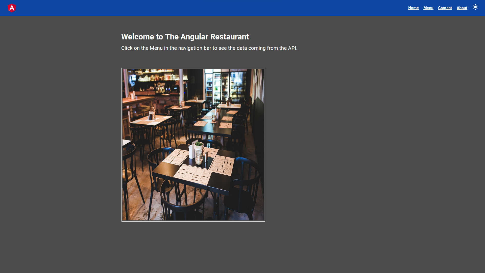

# AngularRestaurant

## Overview

 

This website is a Single-page application and was created using the Angular framework. in addition to the CRUD feature, this website also has the feature to choose between light or dark theme. The theme is stored in localStorage.

### Menu Page

 

### Details Page

### CRUD Page

### API

You can find the API here.

https://github.com/GuilhermeCCunha/restaurant-menu

###  How to use it

1. Download this repository by clicking the green **Code** button on top of the page and then clicking **Download ZIP** option.

2. Access the project root folder on your terminal;

3. Run `npm install` to install all project dependencies (you must have [Node.js](https://nodejs.org/en/download/) installed);

4. To start the application, run `npm start` on your terminal. Or run `ng serve` for a dev server. Navigate to `http://localhost:4200/`. The application will automatically reload if you change any of the source files.

### Website

https://angular-restaurant-iota.vercel.app

